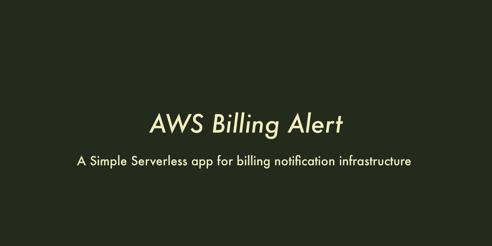

# AWS Billing Alert



This is a stack of AWS billing alert functions built with [Serverless](https://serverless.com/).
Once deployed, notifications would be delivered to a slack channel when the total cost exceeds specified threshold values. The scanning interval is once a day.
Also monthly report will be delivered at the end of month.

## Prerequisite

- Enable `Cost Explorer` for the targeted AWS account
- (recommended) Install `direnv` to inject environmental variables

## Deploy

```shell
$ git clone git@github.com:kamataryo/aws-billing-alert.git
$ cd aws-billing-alert
$ yarn # or npm install
$ cp .envrc.sample .envrc # Please fill the values
$ vi .envrc
$ npm run deploy
```

## Customization

See `.envrc.sample` and `serverless.yml`.

## Run Locally

```shell
$ node ./src/monthly.js --exec
$ node ./src/daily.js --exec
```
